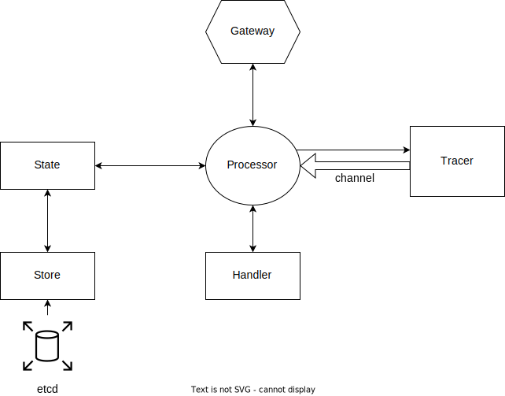
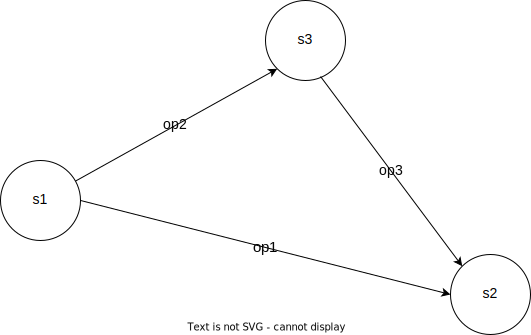

# Saga POC

The POC demonstartes the approach to build micro service oriented arhitecture on the bases of the [gRPC](https://grpc.io/docs/languages/go/basics/) framework designed by Google.

Solution architecture is represented on the figure below:



## Tools
### [gRPC](https://grpc.io/docs/languages/go/basics/)
### [gRPC gateway](https://github.com/grpc-ecosystem/grpc-gateway)
### [buf](https://github.com/bufbuild/buf)
### [Skaffold](https://skaffold.dev/docs/quickstart/)

## Run
```bash
minikube start
skaffold dev --port-forward
```
## Send query



```bash
curl -d '{"workflow": {"name":"default workflow","start":"s1","end":"s2","payload":"1", "operations":[{"name":"op1","from":"s1","to":"s2"},{"name":"op2","from":"s1","to":"s3"},{"name":"op3","from":"s3","to":"s2"}]}}' -H "Content-type: application/json" -X POST http://localhost:9000/v1/saga-processor/execute-workflow
```
